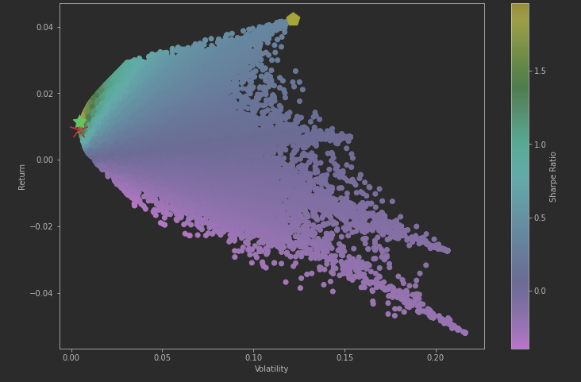
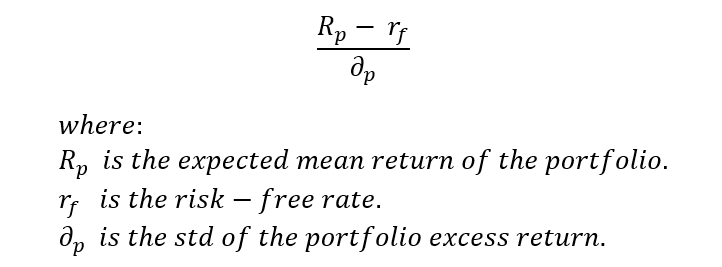

## :chart_with_upwards_trend: Best sharpe ratio using genetic algorithms

### :pill: What is a genetic algorithm?

Genetic Algorithms(GAs) are adaptive heuristic search algorithms that belong
to the larger part of evolutionary algorithms. Genetic algorithms are based
on the ideas of natural selection and genetics. These are intelligent exploitation
of random search provided with historical data to direct the search into the region
of better performance in solution space.

### :gem: Sharpe ratio.
The sharpe ratio is the average return earned in excess of the risk-free rate per unit
of volatility or total risk.

#### How this ratio is calculated?

